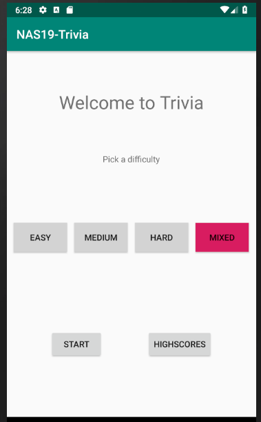
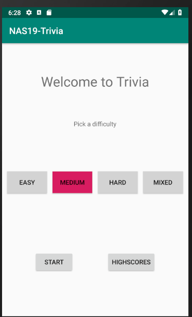
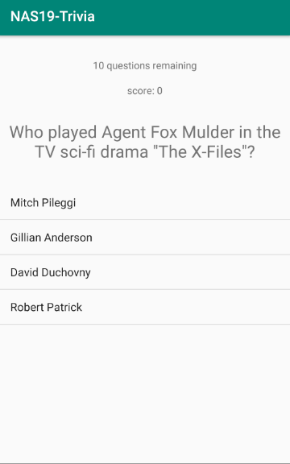
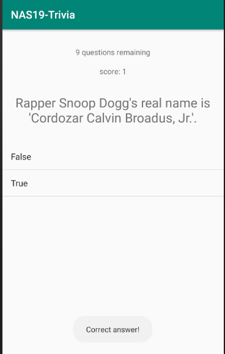
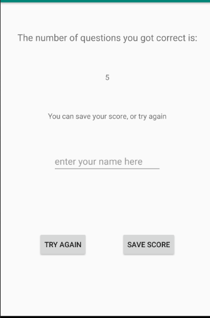
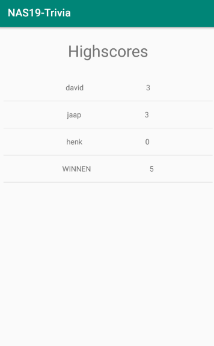

# NAS19-Trivia

This trivia app allows the user to play a game of Trivia using questions obtained from the Opentdb API. Allows a user to select a difficulty level and play based on obtains questions filtered on that difficulty. User can choose to save their score under a name. Supports different screen sizes and rotation.

## Start screen, select a difficulty

## Get different types of questions, feedback on the answers given to questions

## Save your score to the online scoreboard

## A view of the scoreboard

