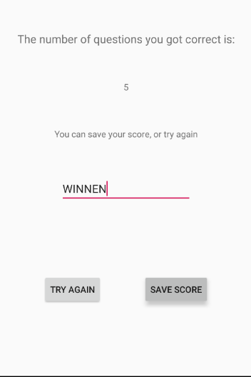

# NAS19-Trivia

This trivia app allows the user to play a game of Trivia using questions obtained from the Opentdb API. Allows a user to select a difficulty level and play based on obtains questions filtered on that difficulty. User can choose to save their score under a name.

